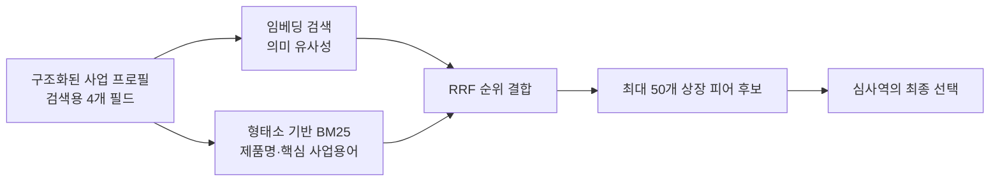
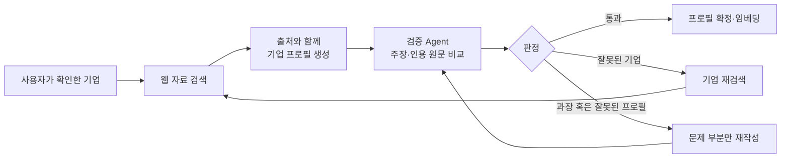
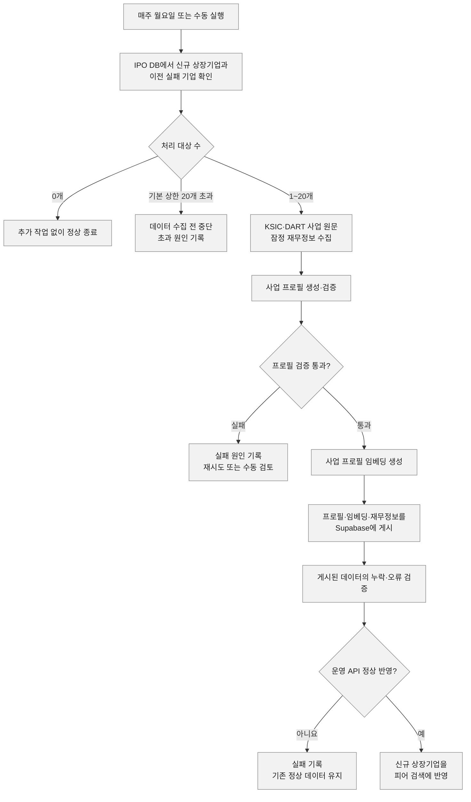

VC는 투자 이후 예상수익률을 계산하기위해서 Exit 가치를 추정한다. 그러나 비상장기업은 시장에서 가격이 형성되지 않았기 때문에 그 가치를 직접 관찰하기 어렵다. 이에 대안책으로 사업모델이 유사하면 유사한 가치평가를 받을 것이라는 가정하에 유사 사업군에 속한 상장기업의 멀티플을 참고하여 비상장기업의 가치를 추정한다. 따라서 적절한 비교기업이자 피어를 선정하는 일은 비상장기업 가치평가의 알파이자 오메가라고 할 수 있다.

## 해결하려는 문제

VC인 K사 업무에는 세 가지 어려움/비효율이 있었다. 첫째, 심사역 개인의 기업과 산업에 대한 사전 정보에 따라서 피어 후보의 범위가 달라졌다. 둘째, 피어를 찾은 뒤에도 각 기업의 재무정보를 직접 확인하고 PER, PSR 등의 멀티플을 수작업으로 계산해야했다. 셋째, 심사역들은 이미 GPT나 Claude를 활용해 피어 후보를 탐색하고 있었지만, 그 결과가 전체 상장사에 대한 검색, 선택한 상장사의 재무정보 조회, 멀티플 계산과 최종 피어 선정으로 이어지는 업무 파이프라인은 구축되어 있지 않았다.

이를 해결하기 위해 피어 탐색부터 재무정보 검토와 최종 선택까지 연결하는 업무 파이프라인을 구축해보기로 결심하였고, 그렇게 한달 반 가량 작업을 진행한 결과, 하나의 End-2-End 서비스를 개발할 수 있었다.

## 서비스의 전체 흐름과 주요 기능

사용자는 분석할 기업명을 검색해 상장기업과 비상장기업을 모두 분석할 수 있다. 상장기업은 시스템에 저장된 사업 프로필을 이용해 바로 피어를 탐색한다. 비상장기업은 검색 결과에서 올바른 회사를 선택한 뒤, 공개 웹 자료를 이용하거나 IR PDF를 업로드해 분석을 시작할 수 있다.

분석이 완료되면 대상 기업의 사업 프로필(기업 정체성, 제품·서비스, 목표시장과 기술)과 국내 상장사 피어 후보가 제시된다. 사용자는 후보별 사업 프로필을 확인하고, 어떤 사업적 공통점 때문에 후보로 선정됐는지 살펴볼 수 있다. 각 기업의 최근 3개년 재무 흐름도 함께 확인할 수 있다.

사용자는 추천된 후보를 직접 선택하거나 제외하고, 시스템이 제시하지 않은 기업을 기업명 또는 종목코드로 추가할 수 있다. 선택한 기업에는 매출액, 영업이익, 순이익과 시가총액뿐 아니라 PER·PSR 및 평균 멀티플이 함께 제공된다. 재무 기준과 시가총액 기준을 변경하거나 멀티플의 최솟값과 최댓값을 제외하면서 비교 결과가 어떻게 달라지는지도 확인할 수 있다.

최종적으로 선택한 피어와 재무정보는 보고서용 표로 정리할 수 있으며, 표의 행과 열 구성 및 평균값 포함 여부를 선택해 Excel 파일로 내려받을 수 있다. 이전에 분석한 기업의 프로필과 피어 결과는 이력 화면에서 다시 열어보거나 메모를 남기고 관리할 수 있다.

서비스는 Next.js·Vercel 프론트엔드와 FastAPI·Railway 백엔드로 구성했다. PostgreSQL 기반의 Supabase는 상장 기업의 프로필, 재무정보를 저장하고 피어 후보를 산출하는 운영 계층으로 사용한다.

OpenDART 재무정보와 시장 데이터를 대량으로 수집, 계산하는 작업에는 DuckDB를 사용했다. DART 등에서 수집한 상장기업 재무 데이터를 기준시점에 맞게 결합하고, 가공한 결과를 파일에 저장하는데 있어서 좋은 도구였기 때문이다.

## 기능별 문제와 개선 과정

지금까지 완성된 시스템의 전체 구조와 기능을 살펴봤다. 그러나 각 기능이 처음부터 현재와 같은 형태로 구현된 것은 아니다. 실제 투자심사 업무에 적용하는 과정에서 비교 기준, 검색 정확도, LLM 결과의 신뢰성 및 운영 자원과 관련된 문제를 확인했고, 각 문제를 해결하며 시스템을 개선했다.

이하에서는 주요 기능에서 어떤 문제가 발생했고, 이를 어떻게 해결했으며, 그 결과 무엇이 달라졌는지를 차례로 설명한다.

## 비상장 기업의 피어 검색 기능은 어떻게 설계했는가

### 1. 업종 코드 대신 실제 사업 내용을 기준으로 삼았다

처음에는 업종 코드를 이용해 같은 산업에 속한 기업을 찾는 방식을 고려했다. 그러나 같은 업종 안에서도 제품, 고객, 기술과 수익구조가 다를 수 있고, 여러 산업에 걸쳐 있거나 신사업을 중심으로 성장하는 기업은 하나의 업종 코드만으로 설명하기 어려웠다. 이에 피어기업 선정에 관한 선행 연구를 검토했다. Eaton et al.(2022)의 *Peer Selection and Valuation in Mergers and Acquisitions*는 세부 산업코드보다 기업의 사업설명에 나타난 제품·시장 유사성이 실제 피어 선택을 더 잘 설명한다는 결과를 제시했다. 이를 바탕으로 피어 후보를 특정 산업분류 안에서만 찾지 않고, 비상장기업과 상장기업의 사업정보를 기업 정체성, 제품·서비스, 목표시장과 기술이라는 4가지 동일 기준으로 정리했다(다른말로는 사업 프로필). 그렇게해서 국내 전체 상장사에서 실제 사업 내용이 유사한 후보를 탐색하고, 심사역이 유사성의 근거를 확인해 최종 피어를 선택할 수 있도록 했다.

### 2. 의미 유사도와 핵심 사업용어를 함께 반영했다

비상장기업의 사업 프로필과 유사한 상장 기업 사업 프로필을 검색하는 과정에서는 의미 기반 임베딩 검색만으로 제품명이나 전문 산업용어의 정확한 일치가 순위에 충분히 반영되지 않을 수 있었다. 반대로 키워드 검색은 정확한 용어를 찾는 데는 강하지만, 같은 사업을 다른 표현으로 설명한 기업을 놓칠 수 있었다. 이에 KorNLI 데이터로 학습된 Ko-SRoBERTa 모델의 임베딩 검색과 한국어 형태소 기반 BM25 검색을 함께 사용했다. 두 검색 방식의 점수 단위가 서로 다르기 때문에 원점수를 직접 더하지 않고, 각 검색 결과의 순위를 이용하는 Reciprocal Rank Fusion으로 결합했다. 이를 통해 의미가 유사한 기업과 핵심 제품·기술 용어가 일치하는 기업을 함께 후보에 반영했으며, 129개 평가 데이터에서 Recall@50이 0.5428에서 0.5964로 향상됐다.

## 생성 Agent와 검증 Agent의 역할 분리

웹 검색 Agent가 작성한 사업 프로필에는 이름이 같은 다른 기업의 정보가 섞이거나, 제시된 출처만으로 뒷받침되지 않는 내용이 포함될 가능성이 있었다. 실제로 비상장 기업인 토스의 프로필에선 반도체에 대한 정보가 섞여 있는 경우가 있었다. 이러한 문제 발생 가능성을 줄이기 위해 먼저 심사역이 검색된 기업을 직접 확인하는 Human-in-the-Loop 절차를 두고, 프로필 생성 Agent와 검증 Agent의 역할을 분리했다. 생성 Agent가 각 사업정보와 출처를 함께 제시하면 별도의 검증 Agent가 해당 주장이 인용 원문에 의해 뒷받침되는지를 판정하도록 했다. 회사가 잘못 식별됐거나 근거가 부족한 경우에는 문제가 있는 출처를 제외해 다시 검색하거나 해당 필드만 재작성하고, 최종 검증을 통과한 프로필만 피어 검색에 사용하도록 했다.

## 피어 후보와 재무정보를 한 화면에 연결

피어 후보를 찾은 뒤에도 심사역이 각 기업의 재무정보를 별도로 확인하고 PER·PSR을 직접 계산해야 한다면 검색 결과가 실제 투자심사 업무로 자연스럽게 이어지기 어려웠다. 이에 검색된 후보마다 사업정보와 선정 근거뿐 아니라 매출액, 순이익, 시가총액 및 동일한 기준으로 계산한 PER·PSR을 한 화면에 제공했다. 그 결과 심사역은 여러 기업의 사업 유사성과 재무적 특성을 함께 비교하면서 최종 피어의 포함과 제외를 직접 결정할 수 있게 됐고, 기존에 반나절가량 걸리던 업무를 약 2~3시간으로 줄일 수 있었다.

## 인메모리 검색을 PostgreSQL로 이전

개발 초기에는 검색 로직을 빠르게 실험하기 위해 전체 상장사의 사업 프로필, 임베딩과 BM25 인덱스를 API 서버의 메모리에 올려 직접 후보를 탐색했다. 데이터가 많지 않은 실험 단계에서는 간단하고 빠른 방법이었지만, 운영 환경에서는 API 프로세스마다 같은 데이터가 중복 적재되면서 메모리 사용량이 1GB 이상으로 증가하기도 했다. 이에 전체 상장사 데이터와 후보 검색 연산을 PostgreSQL로 이전하고, API 서버는 사용자가 입력한 기업의 쿼리 임베딩과 검색 결과 조립만 담당하도록 역할을 분리했다. 이를 통해 상장기업 데이터가 증가하더라도 API 서버의 메모리 사용량이 함께 커지지 않도록 했으며, 동시 사용자가 늘어날 때 API 서버를 확장하기도 쉬워졌다.

## 유지보수

### 신규 상장기업을 자동으로 검색 대상에 반영

상장기업을 기반으로 피어를 탐색하는 시스템에서는 새로운 기업이 상장될 때마다 기업정보와 사업 프로필, 임베딩을 검색 데이터에 추가해야 했다. 이에 GitHub Actions가 매주 IPO 데이터베이스와 기존 상장기업 목록을 비교해 새로 편입됐거나 프로필 작성이 완료되지 않은 기업을 찾도록 했다. 한 번에 최대 20개 기업을 대상으로 KSIC와 DART 사업 원문을 수집하고, 사업 프로필 생성·검증과 Ko-SRoBERTa 임베딩 생성을 거쳐 Supabase에 게시하도록 자동화했다. 게시 후에는 기업 프로필, 임베딩과 서비스 데이터가 모두 정상적으로 반영됐는지 확인하고 Railway API가 동일한 데이터를 제공하는지까지 검증한다. 처리에 실패한 기업은 원인과 함께 다음 실행 대상으로 남기고, 대상 기업이 없으면 불필요한 DART 및 LLM 호출 없이 작업을 종료한다. 이를 통해 전체 상장사 데이터를 매번 다시 생성하지 않고도 신규 상장기업만 점진적으로 검색 대상에 편입할 수 있게 됐다.

## 유지보수

### 담당자가 직접 유지보수할 수 있도록 인수인계

프로젝트 담당자가 시스템을 이해하고 문제에 대응할 수 있어야 해당 서비스가 지속가능하다고 판단했다. 이에 소스코드를 전달하는 데 그치지 않고, 담당자의 로컬 PC에서 GitHub 저장소를 내려받아 Claude나 Codex와 함께 코드를 확인하고 수정할 수 있는 디버깅 환경을 마련했다. GitHub를 사용하는 이유와 브랜치 생성부터 테스트, 병합까지의 작업 절차도 별도의 가이드로 정리하여서 코드 변경사항을 안전하게 관리할 수 있도록 했다.

또한 주요 기능의 작동 원리, 데이터 수집 및 갱신 과정, 기능별 주의사항과 장애 진단 방법을 문서화했다. 문제가 발생했을 때 확인해야 할 항목과 Codex 또는 Claude에 전달해야 할 증상, 관련 파일 및 작업 지침도 함께 정리했다. 이를 통해 담당자가 시스템 전체를 처음부터 분석하지 않더라도 문서를 바탕으로 문제를 설명할 수 있고, 에이전트와 함께 원인을 찾거나 수정 작업을 진행할 수 있도록 인수인계했다.

## 성과와 남은 과제

정리하자면, 이 시스템은 심사역이 이미 알고 있는 기업 안에서만 피어를 선택하는 대신, 국내 전체 상장사를 사업 유사성을 기준으로 탐색하고 선정 근거와 비교 멀티플을 함께 검토할 수 있도록 만들었다. 프로젝트 담당 심사역은 반나절가량 걸리던 초기 피어 검토 업무를 약 2~3시간으로 줄일 수 있다는 점을 가장 직접적인 업무 가치로 평가했다.

이 과정에서 검색 성능을 높이는 것과 사용자에게 유용한 서비스를 만드는 것이 반드시 같은 문제는 아니라는 점도 배웠다. Recall은 정답셋에 포함된 피어를 얼마나 많이 찾아냈는지 평가하는 데 유용하지만, 피어 선정에는 하나의 정답만 존재하지 않으며 심사 목적과 관점에 따라 적절한 후보가 달라질 수 있다. 프로젝트 담당 팀장님 역시 익숙한 기업에 후보군이 한정되지 않고, 기존에 떠올리지 못했던 기업까지 다양한 관점에서 검토하고 싶다고 설명했다. 정답셋에 없는 기업이라도 심사역에게 새로운 비교 관점을 제공한다면 실무적으로는 유의미한 후보가 될 수 있다. 이를 통해 정량 지표의 개선뿐 아니라, 사용자가 실제로 검토할 만한 후보를 발견하고 근거를 바탕으로 판단할 수 있도록 만드는 것이 사용자 중심 서비스에서 중요하다는 점을 깨달았다.

기능을 추가할 때마다 성능을 충분히 비교하고 검증할 수 있는 평가 데이터셋을 구축하지 못한 점은 한계로 남았다. 예를 들어 IR PDF에서 사업정보를 추출하고 필드를 작성하는 과정은 GPT, Gemini와 오픈소스 모델에 동일한 문서와 정답셋을 적용해 정확도, 비용과 처리시간을 비교할 수 있었다. 그러나 실제 투자검토 자료에는 외부 모델에 전달하기 어려운 비공개 정보가 포함될 수 있어 평가에 활용할 수 있는 문서가 제한적이었다. 이에 따라 웹 프로필 검증 Agent의 판정 성능과 IR PDF의 필드 작성 품질을 사람 기준으로 측정하는 작업은 후속 과제로 남겼다.

기업 프로필 생성 모델도 GPT, Claude와 Gemini를 이용해 동일한 기업의 프로필을 각각 작성한 뒤, Ko-SRoBERTa 임베딩과 피어 검색을 거쳤을 때 어떤 모델의 프로필이 더 적절한 후보를 찾아내는지 비교할 수 있었다. 하지만 약 한 달 반의 개발 기간 안에서 모델별로 기업 프로필을 반복 생성하고, 사람 기준의 피어 정답셋과 대조해 결과를 검수하기에는 시간과 비용의 제약이 컸다. 모델 간 비교평가와 평가 데이터셋의 확장은 후속 과제로 남겼다.
