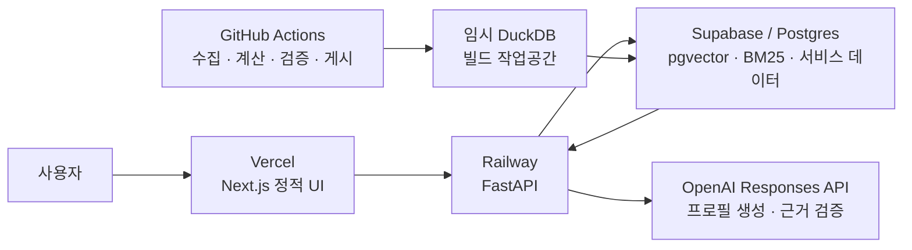
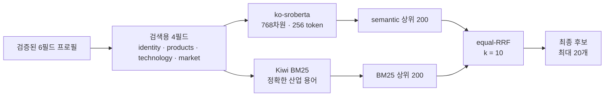
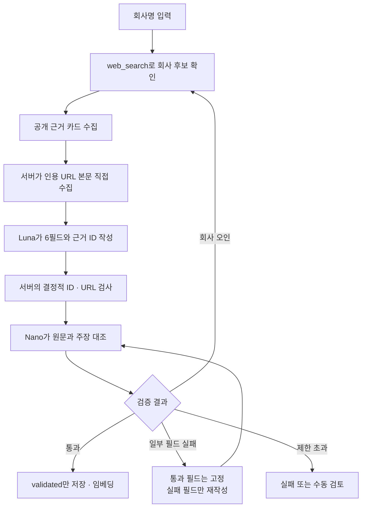

프론트엔드부터 LLMOps·임베딩·유지보수 루프까지, VC 투자심사용 피어그룹 산출 엔진의 설계와 운영을 정리했다.

> [PDF 버전 내려받기](/downloads/peergroup-engineering.pdf)

VC가 비상장 기업을 검토할 때 가장 먼저 부딪히는 문제 중 하나는 “어떤 상장사를 비교 대상으로 볼 것인가”다. 업종 코드가 같다고 사업이 같은 것은 아니고, 회사 소개 문구가 비슷하다고 수익 구조와 전방 시장까지 같은 것도 아니다. 비교 기업이 달라지면 PER·PSR 범위도 달라지기 때문에, 피어 선정은 단순 검색을 넘어 밸류에이션의 출발점이 된다.

우리의 peergroup 프로젝트는 이 문제를 데이터 제품으로 풀었다. 비상장 기업의 웹사이트나 IR 자료를 구조화된 사업 프로필로 바꾸고, 한국 상장사 전체에서 사업적으로 가까운 후보를 찾은 뒤, DART 재무와 시가총액을 연결해 비교 가능한 멀티플을 제공한다.

겉으로 보면 검색 화면과 API로 이루어진 전형적인 웹 서비스처럼 보인다. 하지만 실제 구현의 중심은 화면이나 API 프레임워크가 아니다. 이 프로젝트의 핵심은 다음 세 가지 계약과, 그 계약을 계속 검증하는 여러 개의 루프다.

1. 비상장사와 상장사를 같은 사업 언어로 표현하는 **프로필 계약**
2. 의미 유사성과 정확한 산업 용어를 함께 반영하는 **검색 계약**
3. 같은 세대의 프로필·임베딩·재무만 서비스하는 **데이터 게시 계약**

이 글에서는 프론트엔드와 백엔드가 이 계약을 어떻게 나눠 맡는지, 그리고 LLMOps·임베딩·유지보수를 어떤 엔지니어링 루프로 묶었는지 설명한다.

## 전체 구조: 얇은 화면, 얇은 API, 두꺼운 데이터 계약

운영 구조는 Vercel, Railway, Supabase/Postgres, GitHub Actions로 명확히 분리되어 있다.



프론트엔드는 Next.js 16, React 19, TypeScript로 만든 단일 페이지 애플리케이션이다. 정적 export 결과를 Vercel이 제공하고, 브라우저는 `NEXT_PUBLIC_API_BASE_URL`에 지정된 Railway FastAPI를 직접 호출한다. Vercel에 API 프록시나 서버 비밀키를 두지 않는 구조다.

Railway의 FastAPI는 요청 검증, 인증, 쿼리 임베딩, 캐시와 동시성 제한, 검색 결과와 재무 설명의 조립을 맡는다. 반면 전 상장사의 임베딩 행렬과 재무 데이터를 프로세스 메모리에 상주시켜 검색하지는 않는다. 운영 후보 검색은 Supabase/Postgres의 pgvector와 BM25, equal-RRF RPC가 담당한다.

대규모 수집과 계산은 사용자 요청 경로에서 분리했다. GitHub Actions가 일·주·월·분기·연간 작업을 실행하고, 임시 DuckDB에서 수집 데이터와 계산 결과를 결합한 뒤 검증된 스냅샷만 Supabase에 게시한다. 이 분리 덕분에 실시간 API는 빠르고 작게 유지되고, 무거운 재계산은 재현 가능한 배치로 관리된다.

## 프론트엔드: 계산기가 아니라 분석 작업대

프론트엔드의 역할은 복잡한 계산을 브라우저에서 다시 구현하는 것이 아니다. 사용자가 분석 과정을 이해하고 통제할 수 있도록 백엔드의 근거와 상태를 작업 흐름으로 번역하는 것이 핵심이다.

화면은 크게 비상장 기업 분석, 분석 이력, 계정·키 관리, 관리자 기능으로 나뉜다. 사용자는 회사명이나 IR PDF로 비상장 기업 프로필 생성을 시작하고, 처리 진행 상황을 확인하고, 제안된 상장 피어 중 실제 비교에 사용할 회사를 선택한다. 이후 재무 기간과 시가총액 기준을 바꾸며 PER·PSR 범위를 검토하고, 분석 결과를 저장하거나 다시 불러올 수 있다.

프론트엔드가 특히 중요하게 다루는 것은 다음 세 가지다.

- **긴 작업의 상태**: 웹 리서치와 PDF 프로필 생성은 비동기 작업이다. 화면은 job 상태를 polling하고, 단계별 진행 상황과 실패 이유를 보여준다.
- **근거의 가시성**: TTM이면 단순 숫자만 표시하지 않고 `현재 YTD + 직전 FY - 전년 동기 YTD`의 구성과 DART 원문 링크를 연결한다. 피어 추천도 회사명 목록이 아니라 선정 이유와 프로필 차이를 함께 보여준다.
- **사용자 선택의 분리**: 검색 순위, 상세보기 대상, 평균 멀티플에 포함할 피어를 같은 상태로 취급하지 않는다. 알고리즘의 추천과 투자 심사역의 최종 판단을 분리하기 위해서다.

인증은 Supabase Auth를 사용하고, 브라우저는 Bearer token을 Railway에 전달한다. OpenAI·DART·service-role 같은 비밀은 공개 환경변수에 넣지 않는다. 모든 기능을 Next.js 서버에 몰아넣는 대신 정적 UI와 API의 책임을 분리했기 때문에, 프론트 배포와 백엔드 배포도 독립적으로 수행할 수 있다.

## 백엔드: FastAPI보다 더 중요한 세 개의 계층

백엔드는 Python 3.12+, FastAPI, Typer CLI, DuckDB, Supabase/Postgres를 중심으로 구성된다. 코드 관점에서는 세 계층으로 보는 것이 이해하기 쉽다.

첫째는 **수집·전처리·계산 계층**이다. OpenDART, 거래소·공공 데이터, 웹페이지, IR PDF에서 원천을 모은다. 사업 원문을 구조화하고, CFS와 OFS를 섞지 않는 재무 규칙에 따라 FY·TTM·연환산 값을 계산한다. 시가총액 기준과 PER·PSR도 이 계층에서 만들어진다.

둘째는 **검색·LLM 계층**이다. 상장사와 비상장사를 같은 6필드 프로필로 표현하고, 검색에 쓰는 4필드를 같은 템플릿으로 projection한다. 로컬 한국어 임베딩 모델과 BM25가 후보를 찾고, LLM은 프로필 생성과 근거 검증에 사용된다.

셋째는 **운영 런타임 계층**이다. FastAPI가 API, 인증, 이력, 비동기 job, 캐시, readiness를 제공한다. `/api/health`가 프로세스 생존만 확인한다면, `/api/ready`는 운영 DB 접근, 임베딩 행, 단일 build ID, 서비스 manifest와 임베딩 build의 일치, hybrid RPC 준비 여부까지 검사한다.

여기서 중요한 설계 판단은 “검색이 된다”와 “서비스해도 된다”를 구분한 것이다. 서로 다른 시점의 프로필, 임베딩, 재무가 섞여도 API는 기술적으로 응답할 수 있다. 그러나 그런 응답은 설명과 숫자가 어긋날 수 있다. 그래서 readiness는 단순 health check가 아니라 데이터 세대의 정합성을 확인하는 운영 계약이다.

## 임베딩 검색: 의미와 정확한 용어를 함께 찾기

기업 프로필은 여섯 필드로 저장한다.

- `identity`: 회사의 정체성
- `products`: 제품과 서비스
- `market`: 고객과 전방 시장
- `business_model`: 수익 방식
- `value_chain`: 밸류체인에서의 역할
- `technology`: 실제 비교축이 되는 차별적 기술

이 중 검색에는 `identity + products + technology + market`을 사용한다. `business_model`과 `value_chain`은 사람이 읽는 설명과 밸류에이션 문맥에는 중요하지만, 현재 운영 랭킹의 임베딩 축에는 포함하지 않는다.



Dense 검색은 `jhgan/ko-sroberta-multitask` 기반의 768차원 단일 프로필 임베딩을 사용한다. 쿼리와 상장사 코퍼스 모두 같은 필드 순서와 256-token 계약을 따라야 한다. 같은 의미를 다른 말로 표현한 회사를 찾는 데 강점이 있다.

하지만 기업 검색에는 CDMO, LIDAR, 양극재처럼 정확히 일치해야 의미가 살아나는 용어가 많다. 이를 보완하기 위해 Kiwi 형태소 분석 기반 BM25를 함께 쓴다. 운영 tokenizer는 명사·고유명사·외국어·숫자 등 의미 있는 토큰을 사용하며, 임의의 한국어 글자 n-gram은 제거했다.

두 점수는 단위가 다르기 때문에 직접 더하지 않는다. semantic 상위 200개와 BM25 상위 200개를 각각 만든 뒤, 각 순위에 `1 / (10 + rank)`를 부여하는 equal-RRF로 합친다. 최종 후보만 Railway로 전달되므로 API 프로세스가 전체 벡터 행렬을 보유할 필요도 없다.

운영 검색 가중치는 고정되어 있다. 사용자가 임의로 facet이나 weight를 바꾸는 API 요청은 거절한다. 모델이나 토큰 길이, 필드 순서, RRF 상수를 바꾸려면 코퍼스 전체를 같은 계약으로 다시 임베딩하고 대규모 평가셋에서 재측정해야 한다. 작은 샘플에서 좋아 보이는 변경이 전체 유니버스에서는 뒤집힐 수 있다는 경험이 반영된 원칙이다.

## LLMOps: 생성보다 검증이 더 긴 파이프라인

LLM은 최종 피어 순위를 마음대로 다시 정하는 만능 심사역으로 사용하지 않는다. 기본 API는 retrieval-only다. LLM의 주된 역할은 비정형 원문을 검색 가능한 프로필로 바꾸고, 그 프로필이 실제 근거에 부합하는지 검사하는 것이다.

비상장 웹 프로필을 예로 들면 흐름은 다음과 같다.



기본 생성·검색 모델은 OpenAI Responses API의 `gpt-5.6-luna`, reasoning effort는 `medium`이다. 근거 판정은 상대적으로 작은 `gpt-5-nano`와 `low` 설정으로 분리한다. 비싼 모델 하나에 모든 책임을 맡기기보다, 생성기와 판정기의 역할과 비용을 다르게 설계한 것이다.

여기서 LLMOps의 핵심은 모델 호출 자체가 아니라 **검증 가능한 상태 전이**다.

- 생성 결과는 JSON object 계약을 통과해야 한다.
- 각 필드는 자신이 인용한 근거 ID를 가져야 한다.
- 서버가 URL 본문을 직접 읽어 실제 인용 페이지와 내용을 확인한다.
- Nano judge가 회사 일치, 범위 적합성, 주장 근거를 원문과 대조한다.
- `wrong_company`이면 해당 URL을 버리고 회사 확인부터 다시 한다.
- `off_scope`나 `unsupported_claim`이면 통과한 필드를 고정하고 실패 필드만 재작성한다.
- 최종 검증을 통과한 `validated` 프로필만 임베딩하고 검색에 사용한다.

실패를 그럴듯한 문장으로 덮는 fallback은 허용하지 않는다. API key 누락처럼 재시도로 해결되지 않는 오류는 즉시 종료하고, 네트워크·JSON·근거 부족처럼 복구 가능한 오류만 제한된 횟수 안에서 다시 시도한다. 프롬프트 버전과 validation status를 기록하며, 검증 메타데이터가 없는 과거 웹 프로필은 자동으로 재사용하지 않는다.

보안도 LLMOps 계약 안에 들어 있다. 서버가 최초 URL과 redirect 목적지의 사설·로컬 네트워크 접근을 차단해 SSRF를 막고, 내용이 거의 없는 껍데기 페이지는 근거로 인정하지 않는다. 원문 전문은 기본 24시간 메모리 캐시에만 두고, 장기 저장물에는 URL, 길이, 해시 등 감사 정보만 남긴다.

상장사 신규 프로필도 같은 철학을 따른다. Luna가 DART 사업 원문으로 필드를 작성하면 Nano가 같은 원문에 대조한다. 제한된 수정 루프가 끝나도 검증되지 않은 기업은 임베딩하거나 게시하지 않는다.

## Loop engineering: 모델이 아니라 시스템을 개선하는 방법

이 프로젝트에서 loop engineering은 “LLM이 스스로 계속 고친다”는 의미가 아니다. 입력, 판단, 검증, 실패 처리, 배포 조건을 닫힌 고리로 만들고, 각 고리에 종료 조건과 사람의 개입 지점을 두는 방식에 가깝다.

### 1. 생성–검증 루프

LLM이 프로필을 생성하고, 결정적 검사와 별도 judge가 원문에 대조한다. 실패 유형에 따라 전체를 다시 탐색할지, 특정 필드만 고칠지를 나눈다. 무한 재시도는 없고 시도 횟수와 research cycle에 상한이 있다. 반복 실패는 검색 결과로 흘려보내지 않고 실패 또는 `manual_review`로 격리한다.

### 2. 검색–평가 루프

검색 스택은 직관으로 교체하지 않는다. 구조화 쿼리, 임베딩 모델, 토큰 길이, tokenizer, fusion 상수를 하나의 실험 계약으로 고정하고, 변경 후보를 대규모 IPO 평가셋에서 비교한다. 작은 후보군의 개선이 전체 종목에서는 반전될 수 있기 때문이다. 코드, 회귀 테스트, `CURRENT_STACK.md`, 방법론 문서가 같은 계약을 말할 때만 변경이 끝난다.

### 3. 빌드–게시–readiness 루프

새 데이터는 바로 운영 테이블을 덮어쓰지 않는다. 임시 DuckDB에서 재계산하고, 프로필·재무·임베딩을 검증한 뒤 새 build ID로 게시한다. 원격 Postgres에서 다시 읽어 일치 여부를 확인하고, Railway `/api/ready`가 같은 build ID를 보고해야 완료다. 실패하면 active build를 바꾸지 않아 프론트는 마지막 정상 데이터를 계속 제공한다.

### 4. 신고–수정–검증 루프

사용자가 화면의 **계정·키 관리 → 문제 알려주기**로 제출한 신고만 유지보수 control plane의 입력이 된다. 신고는 진단을 시작하는 질문이지, 자동 수정 권한이나 장애의 증거가 아니다. 운영 에이전트는 신고와 재현 증거를 묶고, 제한된 repair plan을 만든 뒤, 허용 수준에 따라 dry-run·수정·검증을 진행한다.

이 네 루프는 서로 연결되지만 같은 권한으로 움직이지 않는다. LLM의 필드 수정은 자동화할 수 있어도, DB migration이나 secret 변경까지 자동화해서는 안 된다. 좋은 loop engineering의 핵심은 자동화율이 아니라 **어디서 멈춰야 하는지가 명확한 것**이다.

## 유지보수: 사용자 신고에서 검증된 해결까지

유지보수 에이전트는 일반적인 자동 모니터링 시스템과 의도적으로 다르게 설계했다. 브라우저 telemetry, synthetic monitoring, provider probe, 예약 workflow 상태, 배포 비교, 데이터 최신성 검사는 자동으로 incident를 만들지 않는다. 오직 로그인 사용자가 직접 제출한 신고와 후속 메시지만 intake한다.

신고 상태는 다음 생명주기를 따른다.

```text
RECEIVED → INVESTIGATING → FIXING → RESOLVED
                         ↘ NEEDS_INFO
```

`maintenance-check`는 신고를 읽어 민감정보가 제거된 증거를 만들고, `maintenance-run`은 그 증거에 묶인 repair plan을 기본 dry-run으로 보여준다. 오래된 증거로 만든 plan이 실행되지 않도록 checksum으로 바인딩하며, 알 수 없는 action은 실행하지 않는다. 자동 실행은 허용 목록에 있는 L1/L2 작업과 최대 두 번의 재시도로 제한한다.

코드 수정인 L3는 `codex/maintenance-<incident-id>` 전용 브랜치에서 최소 수정과 검증을 거쳐 PR을 만들고, 자동 병합하지 않는다. DB 삭제·migration·전체 교체·secret 변경인 L4는 정확한 대상과 rollback·검증 계획을 제시한 뒤 사람의 승인을 기다린다. `resolved` 역시 추정이 아니라 결정적 검증 이후에만 기록한다.

모든 요청에는 request ID, trace ID, API build ID를 붙인다. 본문이나 credential을 로그에 남기지 않으면서도, 사용자의 실패 화면과 Railway 요청, 배포 세대를 연결할 수 있게 하기 위해서다. 이 세 식별자는 프론트–백엔드–데이터 게시 사이의 장애를 좁히는 공통 언어가 된다.

## 데이터 운영: 전체 재빌드보다 증분 상태 머신

데이터 갱신도 하나의 거대한 배치보다 주기와 실패 단위를 나눈다.

- 매일: 주가·시가총액 변경과 최근 DART 정정·지연 공시 탐지
- 매주: 신규 상장사, KSIC, 사업 프로필, 증분 임베딩
- 매월: 월평균 시총과 최근 36개월 기준 계산
- 분기: DART FY·Q1·H1·Q3 재무와 TTM 갱신
- 매년: 전체 사업 프로필과 임베딩 재검증

신규 상장사는 `detected → universe_published → validated → published` 상태를 지나며, 공시가 없으면 `waiting_for_filing`, 일시 오류는 `failed_transient`, 반복 오류는 `manual_review`로 이동한다. 프로필, 임베딩, 서비스 행의 build ID가 모두 같아야 게시 완료다.

분기 재무도 접수번호 단위로 새 공시와 정정 공시를 탐지한다. 한 기업의 실패가 전체 게시를 막지 않으며, 재시도 후에도 실패한 기업만 수동 검토로 격리한다. DART 자체 장애나 rate limit은 기업의 실패 횟수로 소모하지 않는다. 변경이 없는 기업은 LLM과 임베딩 호출을 건너뛰어 비용과 변동성을 줄인다.

이 구조는 데이터 파이프라인에도 LLMOps의 기본 원칙을 적용한 것이다. 모든 항목에 상태가 있고, 재시도 조건이 있고, 마지막 정상본이 있고, 사람이 맡아야 할 경계가 있다.

## 우리가 선택한 프레임워크의 장점과 남은 과제

Next.js 정적 프론트, FastAPI 런타임, Supabase/Postgres 검색, DuckDB 빌드 작업공간의 조합은 책임 경계를 선명하게 만든다. 프론트는 사용자 경험에 집중하고, API는 얇은 orchestration 계층으로 남으며, 무거운 검색과 데이터는 목적에 맞는 저장소에서 처리된다. GitHub Actions는 동일한 CLI와 검증 절차로 배치를 재현한다.

특히 임베딩과 LLM을 분리한 점이 중요하다. 한국어 임베딩은 로컬 모델로 안정적으로 운영하고, LLM은 구조화와 근거 판정처럼 생성 능력이 필요한 곳에 제한한다. 기본 피어 순위는 재현 가능한 dense·BM25 hybrid가 결정하므로, API key나 LLM 응답 변동이 검색 전체를 흔들지 않는다.

물론 남은 과제도 있다. 현재 비상장 웹·PDF 작업은 로그인 사용자의 상태 snapshot을 Supabase에 남길 수 있지만, 실제 계산 실행은 프로세스 내부 executor에 있다. 서버 재시작 후 상태는 확인할 수 있어도 작업을 이어서 실행하지는 못하므로, 멀티 인스턴스 확장 전에는 외부 durable queue와 worker가 필요하다. 검색 품질 측면에서는 field-aware exact-term boost, top-50 second-stage reranker, 주관사 recall을 넘어 실제 투자 판단과 가까운 outcome 평가가 다음 레버다.

## 마치며

AI 기능을 제품에 넣는 일은 모델 API를 호출하는 것으로 끝나지 않는다. 특히 투자 심사처럼 근거와 재현성이 중요한 영역에서는 “무엇을 생성했는가”보다 “어떤 원문에서 왔고, 누가 검증했으며, 실패했을 때 어디서 멈추는가”가 더 중요하다.

우리 프로젝트의 프론트와 백엔드는 이 원칙을 중심으로 만들어졌다. Next.js와 FastAPI는 사용자와 시스템을 연결하는 프레임이고, ko-sroberta·BM25·RRF는 재현 가능한 검색의 기반이다. 그 위에 생성–검증, 검색–평가, 빌드–게시, 신고–수정 루프를 얹어 LLM과 데이터가 운영 환경에서 통제 가능한 방식으로 움직이게 했다.

결국 이 시스템의 경쟁력은 화려한 단일 모델이 아니라, **검증된 프로필이 검증된 임베딩과 재무를 만나고, 문제가 생기면 증거를 따라 다시 정상 상태로 돌아오는 구조**에 있다.

---

### PDF로 읽기

본문과 세 개의 다이어그램을 A4 문서로 조판한 [PDF 버전](/downloads/peergroup-engineering.pdf)도 제공한다.
