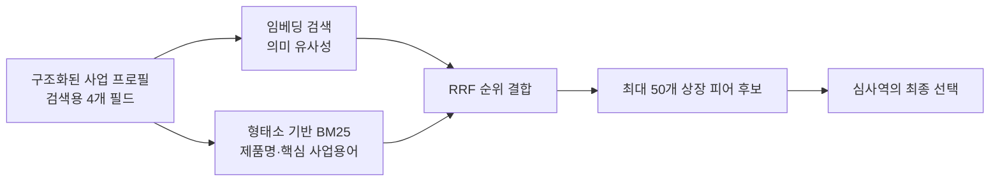
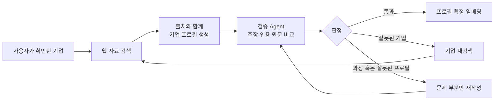
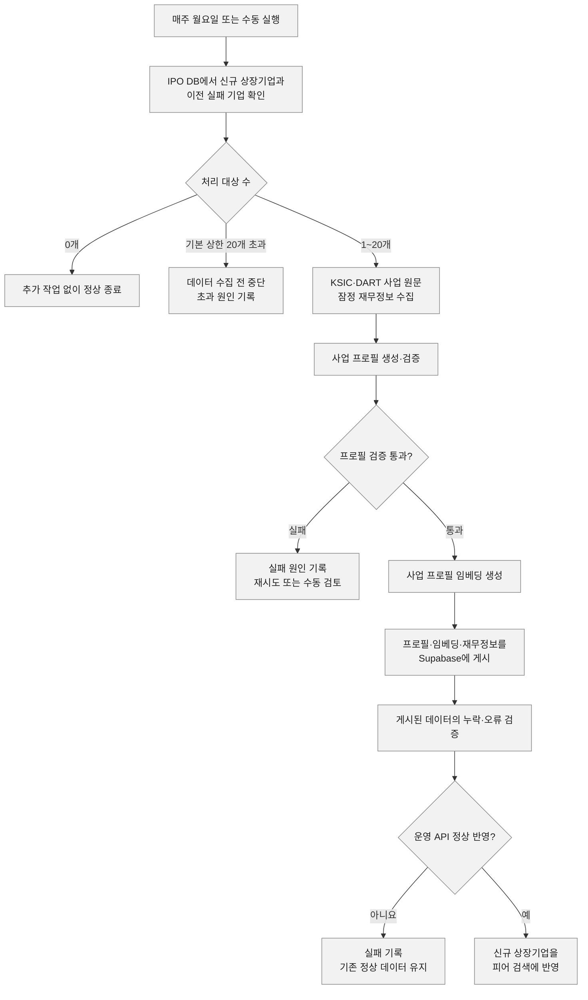

## 배경

VC는 비상장기업의 Exit 가치를 직접 관측하기 어렵기 때문에, 사업모델이 유사한 상장기업의 멀티플을 활용해 기업가치를 추정한다. 따라서 적절한 비교기업(Peer)을 선정하는 것은 비상장기업 가치평가의 핵심이다.

그러나 VC K사의 기존 업무에는 세 가지 비효율이 있었다.

- 첫째, 심사역의 사전지식에 따라 피어 후보가 달라졌고,
- 둘째, 후보 선정 후에도 재무정보 조회와 PER·PSR 등 멀티플 계산을 수작업으로 진행해야 했다.
- 셋째, ChatGPT나 Claude를 피어 탐색에 활용하고 있었지만 전체 상장사 검색부터 재무정보 조회·멀티플 계산·최종 피어 선정까지 하나의 업무 흐름으로 연결되지 않았다.

이에 심사역 인터뷰와 업무 관찰을 바탕으로, 전체 상장사에서 데이터 기반으로 다양한 피어 후보를 탐색하고 사업 유사성 근거와 재무정보를 한 화면에서 제공하는 서비스를 구축하기로 했다.

## 서비스의 전체 흐름과 주요 기능

사용자가 대상 기업을 검색하고 웹 자료 또는 IR PDF를 입력하면, 시스템은 기업의 사업 프로필을 분석해 유사한 상장사 피어 후보와 선정 근거를 제시한다. 각 후보의 사업적 공통점과 최근 3개년 재무 흐름도 함께 확인할 수 있다.

사용자는 추천 후보를 직접 선택·제외하거나 새로운 기업을 추가할 수 있으며, 선택 기업의 매출·영업이익·순이익·시가총액과 PER·PSR 등 멀티플을 비교할 수 있다. 재무·시가총액 기준이나 이상치 제외 조건을 변경해 결과의 변화를 확인하고, 최종 결과를 보고서용 표로 구성해 엑셀로 내려받을 수 있다. 과거 분석 결과는 이력 화면에서 다시 조회·관리할 수 있다.

서비스는 Next.js·Vercel 프론트엔드와 FastAPI·Railway 백엔드로 구성했으며, Supabase에 상장사 프로필과 재무정보를 저장했다. OpenDART와 시장 데이터의 대량 수집·결합·가공에는 DuckDB를 활용해 기준시점별 재무 데이터를 구축했다.

## 기능별 문제와 개선 과정

이하는 해당 시스템을 실제 업무에 적용가능한 수준으로 완성하는 과정에서 마주한 문제와 해결 과정을 설명한다.

## 비상장 기업의 피어 검색 기능은 어떻게 설계했는가

### 1. 업종 코드 대신 실제 사업 내용을 기준으로 삼았다

심사역 인터뷰에서 사업적으로 유사한 기업을 정확하게 찾으면서도, 기존의 사전지식에 갇히지 않고 다양한 후보를 폭넓게 추천받고 싶다는 요구를 확인한 이후, 처음에는 업종 코드를 활용해 같은 산업의 기업을 찾는 방식을 고려했다. 하지만 같은 업종에서도 제품·고객·기술·수익구조가 다르고, 여러 산업에 걸치거나 신사업 중심으로 성장하는 기업은 하나의 업종 코드만으로 설명하기 어려웠다.

이에 Eaton et al. (2022)의 [*Peer Selection and Valuation in Mergers and Acquisitions*](https://www.sciencedirect.com/science/article/abs/pii/S0304405X21003834)를 참고해 산업분류보다 실제 사업 내용의 유사성을 중심으로 피어를 탐색했다. 비상장기업과 전체 상장사의 사업정보를 기업 정체성, 제품·서비스, 목표시장, 기술의 4가지 기준으로 구조화하고, 이를 바탕으로 정확성과 후보 다양성을 함께 고려해 추천했다. 이후 심사역이 각 후보의 사업 유사성 근거를 확인하고 최종 피어를 선택하도록 설계했다.

### 2. 의미 유사도와 핵심 사업용어를 함께 반영했다

사업 프로필 검색에서는 의미적 유사성과 핵심 용어의 정확한 일치를 함께 반영할 필요가 있었다. 임베딩 검색만으로는 제품명·산업용어의 정확한 일치를 놓칠 수 있고, 키워드 검색만으로는 같은 사업을 다른 표현으로 설명한 기업을 찾기 어려웠다.

이에 Ko-SRoBERTa 임베딩 검색과 형태소 기반 BM25 검색을 결합하고, 서로 다른 점수 체계를 보완하기 위해 Reciprocal Rank Fusion(RRF)으로 순위를 통합했다. 이를 통해 의미가 유사한 기업과 핵심 제품·기술 용어가 일치하는 기업을 함께 추천했으며, 129개 평가 데이터에서 Recall@50을 0.5428에서 0.6064로 개선했다.

## 생성 Agent와 검증 Agent의 역할 분리 및 Kiwi 형태소 분석기

웹 검색 Agent가 생성한 사업 프로필에는 동명이인 기업의 정보가 섞이거나, 출처로 뒷받침되지 않는 내용이 포함되는 문제가 발생할 수 있었다. 실제로 반복 테스트 과정에서 비상장기업 토스의 프로필에 반도체 관련 정보가 섞이는 오류를 발견했다.

이를 단순한 예외로 넘기지 않고 검색 과정을 추적한 결과, 문자 n-gram 기반 키워드 처리에서 오매칭이 발생하는 지점을 확인했다. ("토스플레이스" <-> "디스플레이") 이후 이를 Kiwi 형태소 분석 기반 검색으로 교체하고 동일 데이터로 재검증해 오류가 해소되는지 확인했다.

동시에 프로필 생성 단계의 신뢰성을 높이기 위해 심사역이 검색된 기업을 확인하는 Human-in-the-Loop 절차를 두고, 프로필 생성 Agent와 검증 Agent를 분리했다. 생성 Agent가 사업정보와 출처를 함께 제시하면 검증 Agent가 각 주장이 인용 원문에 의해 뒷받침되는지 판정하도록 했다. 회사 식별이 잘못됐거나 근거가 부족한 경우에는 해당 출처를 제외해 재검색하거나 해당 필드만 재작성하고, 최종 검증을 통과한 프로필만 피어 검색에 사용하도록 설계했다.

## 피어 후보와 재무정보를 한 화면에 연결

피어 후보를 찾은 뒤에도 심사역이 각 기업의 재무정보를 별도로 확인하고 PER·PSR을 직접 계산해야 한다면 검색 결과가 실제 투자심사 업무로 자연스럽게 이어지기 어려웠다. 이에 검색된 후보마다 사업정보와 선정 근거뿐 아니라 매출액, 순이익, 시가총액 및 동일한 기준으로 계산한 PER·PSR을 한 화면에 제공했다. 그 결과 심사역은 여러 기업의 사업 유사성과 재무적 특성을 함께 비교하면서 최종 피어의 포함과 제외를 직접 결정할 수 있게 됐고, 기존에 반나절가량 걸리던 업무를 약 2~3시간으로 줄일 수 있었다.

## 인메모리 검색을 PostgreSQL로 이전

개발 초기에는 검색 로직을 빠르게 실험하기 위해 전체 상장사의 사업 프로필, 임베딩과 BM25 인덱스를 API 서버의 메모리에 올려 직접 후보를 탐색했다. 데이터가 많지 않은 실험 단계에서는 간단하고 빠른 방법이었지만, 운영 환경에서는 API 프로세스마다 같은 데이터가 중복 적재되면서 메모리 사용량이 1GB 이상으로 증가하기도 했다. 이에 전체 상장사 데이터와 후보 검색 연산을 PostgreSQL로 이전하고, API 서버는 사용자가 입력한 기업의 쿼리 임베딩과 검색 결과 조립만 담당하도록 역할을 분리했다. 이를 통해 상장기업 데이터가 증가하더라도 API 서버의 메모리 사용량이 함께 커지지 않도록 했으며, 동시 사용자가 늘어날 때 API 서버를 확장하기도 쉬워졌다.

## 유지보수

### 신규 상장기업을 자동으로 검색 대상에 반영

상장기업을 기반으로 피어를 탐색하는 시스템에서는 새로운 기업이 상장될 때마다 기업정보와 사업 프로필, 임베딩을 검색 데이터에 추가해야 했다. 이에 GitHub Actions가 매주 IPO 데이터베이스와 기존 상장기업 목록을 비교해 새로 편입됐거나 프로필 작성이 완료되지 않은 기업을 찾도록 했다. 한 번에 최대 20개 기업을 대상으로 KSIC와 DART 사업 원문을 수집하고, 사업 프로필 생성·검증과 Ko-SRoBERTa 임베딩 생성을 거쳐 Supabase에 게시하도록 자동화했다.

## 유지보수

### 담당자가 직접 유지보수할 수 있도록 인수인계

프로젝트 담당자가 시스템을 이해하고 문제에 대응할 수 있어야 해당 서비스가 지속가능하다고 판단했다. 이에 소스코드를 전달하는 데 그치지 않고, 담당자의 로컬 PC에서 GitHub 저장소를 내려받아 Claude나 Codex와 함께 코드를 확인하고 수정할 수 있는 디버깅 환경을 마련했다. GitHub를 사용하는 이유와 브랜치 생성부터 테스트, 병합까지의 작업 절차도 별도의 가이드로 정리하여서 코드 변경사항을 안전하게 관리할 수 있도록 했다.

또한 주요 기능의 작동 원리, 데이터 수집 및 갱신 과정, 기능별 주의사항과 장애 진단 방법을 문서화했다. 문제가 발생했을 때 확인해야 할 항목과 Codex 또는 Claude에 전달해야 할 증상, 관련 파일 및 작업 지침도 함께 정리했다. 이를 통해 담당자가 시스템 전체를 처음부터 분석하지 않더라도 문서를 바탕으로 문제를 설명할 수 있고, 에이전트와 함께 원인을 찾거나 수정 작업을 진행할 수 있도록 인수인계했다.

## 성과와 남은 과제

정리하면, 이 시스템은 심사역이 기존의 사전지식과 편향에서 벗어나 국내 상장사 전체에서 사업적으로 유사한 피어 후보를 탐색하고, 선정 근거와 비교 멀티플을 함께 검토할 수 있도록 설계했다. 프로젝트 담당 심사역은 반나절가량 걸리던 초기 피어 검토를 약 2~3시간으로 단축할 수 있다는 점을 가장 직접적인 업무 가치로 평가했다.

프로젝트를 통해 검색 성능과 사용자에게 유용한 추천은 반드시 같은 문제가 아니라는 점도 배웠다. Recall은 정답셋의 피어를 얼마나 놓치지 않고 찾았는지 평가할 수 있지만, 실제 피어 선정에는 하나의 정답만 존재하지 않는다. 정답셋에 없더라도 심사역이 기존에 생각하지 못했던 비교 관점을 제공한다면 유의미한 후보가 될 수 있었다. 따라서 정량 지표뿐 아니라 사용자가 실제로 검토할 만한 후보를 발견하고, 근거를 바탕으로 판단할 수 있게 하는 것이 중요하다고 판단했다.

한편 개발 기간이 약 한 달 반으로 짧고, 실제 IR 자료에는 외부 모델에 전달하기 어려운 비공개 정보가 포함될 수 있어 기능별 평가 데이터셋을 충분히 구축하지 못한 점은 한계로 남았다. 일부 IR PDF 추출 기능은 여러 모델의 정확도·비용·처리시간을 비교했지만, 웹 프로필 검증 Agent와 IR 필드 작성 품질에 대한 체계적인 사람 기준 평가는 진행하지 못해 후속 과제로 남겼다.
